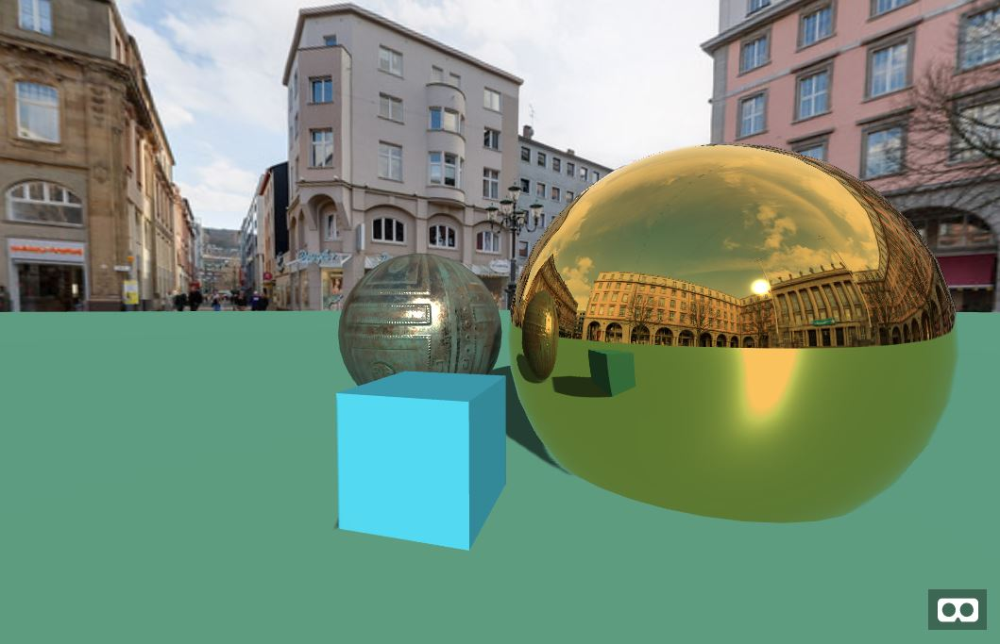
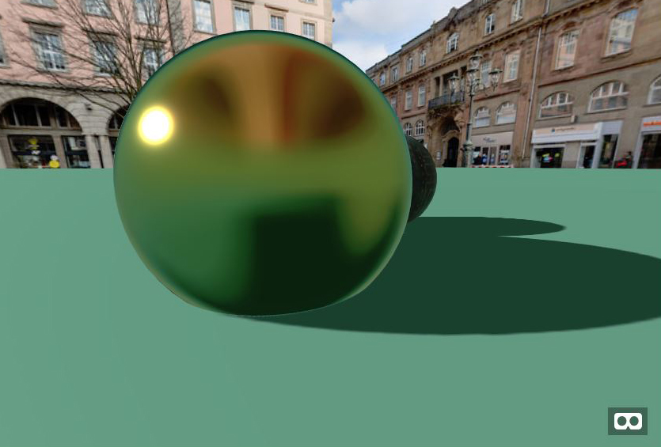
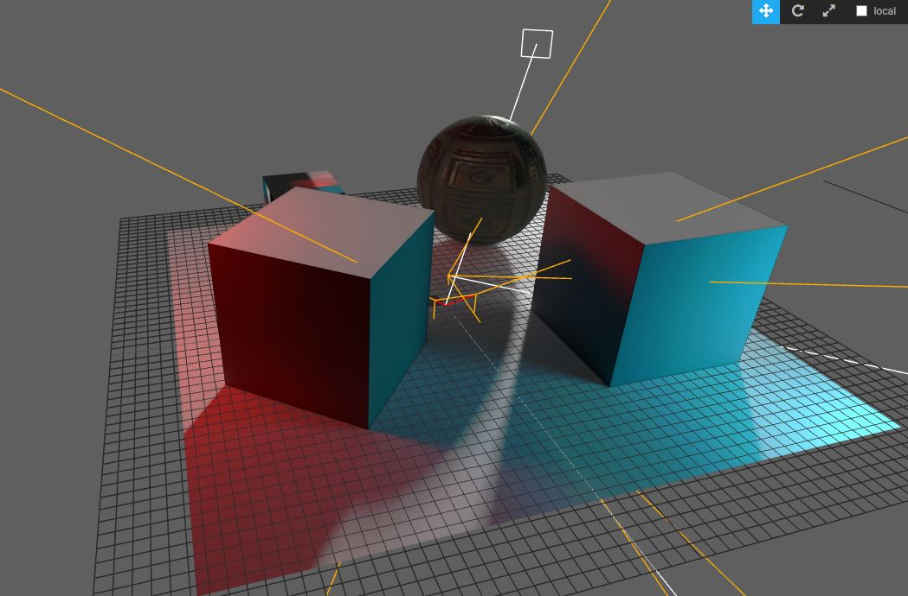

# aframe_Components
a reopository or aframe components developed or modified by me for Aframe-VR

https://colinfizgig.github.io/aframe_Components/

# camera-cube-env component

a component to inject cubemap envMaps into an object based on the objects position.  This allows you to capture the environment at runtime without much cost to rendering.

Just add the
# camera-cube-env="distance: 100000; resolution: 256"
to your elements.  You can play with the resolution that works for you.  It also has a repeat attribute which if set to true allows you to capture animation or changes in the environment in realtime.  This occurs at the expense of fps so use it lightly if at all.

-------------------------------------------------------------------------------------------------

# refract-cube-env component

a component to inject cubemap refraction envMaps into an object based on the objects position.  This allows you to capture the environment at runtime without much cost to rendering.  The effect emulates thick transparent glass objects.

Just add the
# refract-cube-env="distance: 5000; resolution: 256; refractionratio: 0.8"
to your elements.  You can play with the resolution that works for you.  You can modify the refraction ratio to get more or less distortion in the refraction. It also has a repeat attribute which if set to true allows you to capture animation or changes in the environment in realtime.  This occurs at the expense of fps so use it lightly if at all.

-------------------------------------------------------------------------------------------------

# cube-env-map component

a component to inject a cubemap into an objects material using specific named maps.  Not as efficient or useful as the camera-cube-env component but might be useful for specific situations.

Just add the
# cube-env-map="path: ./path/to/some/texture; extension: jpg"
to your elements.  Like the cube camera it will parse through the objects looking for materials with a envMap and replace them with the specified images with the following names: posx.jpg, negx.jpg, posy.jpg, negy.jpg, negz.jpg, posz.jpg

# light-map-geometry

A component to inject pre-rendered lightmaps and a second set of UVs to take advantage of three.js lightmap node for the standard material.  This is useful for baking global illumination and shadows into your scenes while allowing for seperate tilable textures for color, bump, roughness and metal maps.  It might also be useful to turn on the second UV set required for AO maps.  The component creates these UVs by duplicating each mesh's current UV map.

Check out the lightTest.html and lightTest_AllShadows.html to see them in action.  lightTest has no shadows turned on and uses a shadow map as a roughness map on the plane to obscure the specularity of the material.  lightTest_AllShadows uses cast shadows to obscure the specularity.  The shadows are not perfectly matched to the baked shadows so they are rather obvious, but this might be useful for hybrd scenes where some dynamic object precludes light baking for some elements of the scene.

to use the lightmap component just add
# light-map-geometry="path:./path/to/bakedlight image using Default UVs for object.jpg"
The component will duplicate the UVs and inject the lightmap texture into the material.
